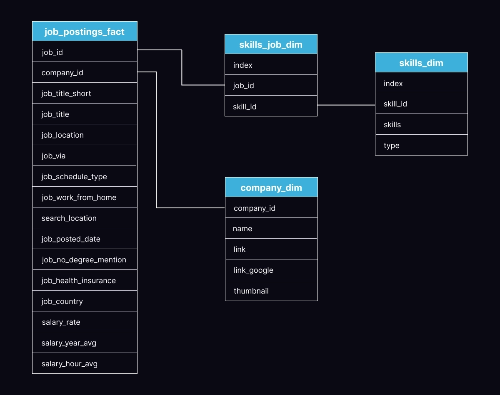
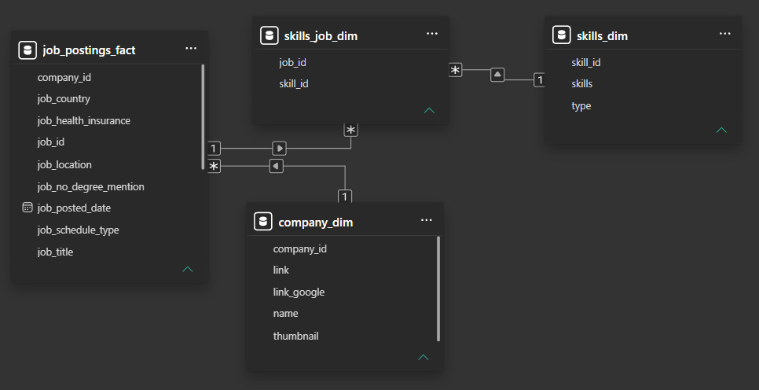
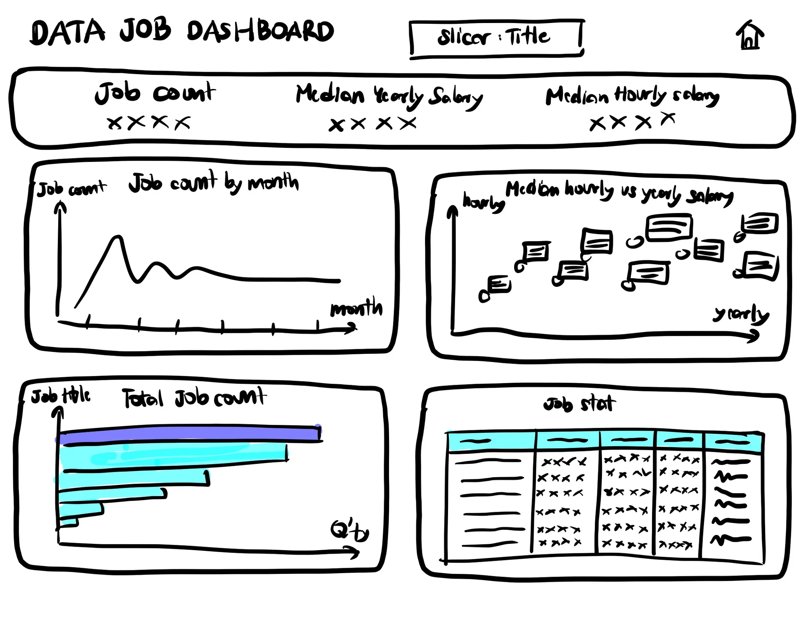
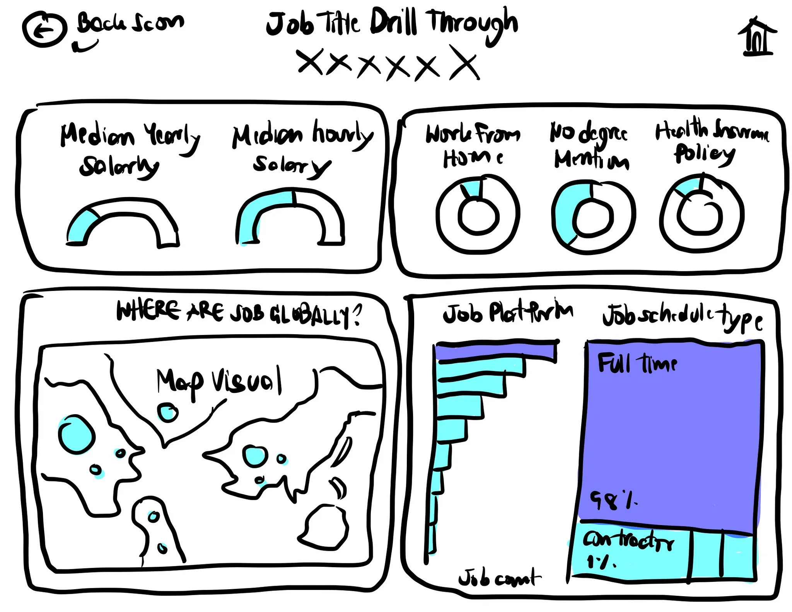
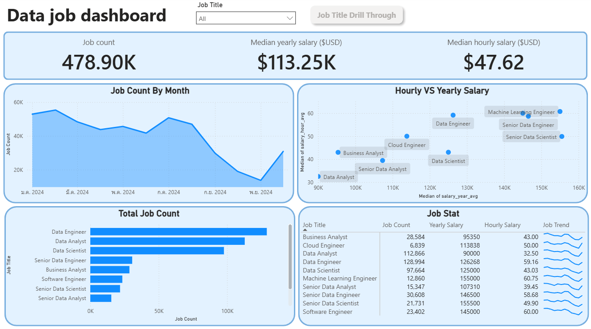
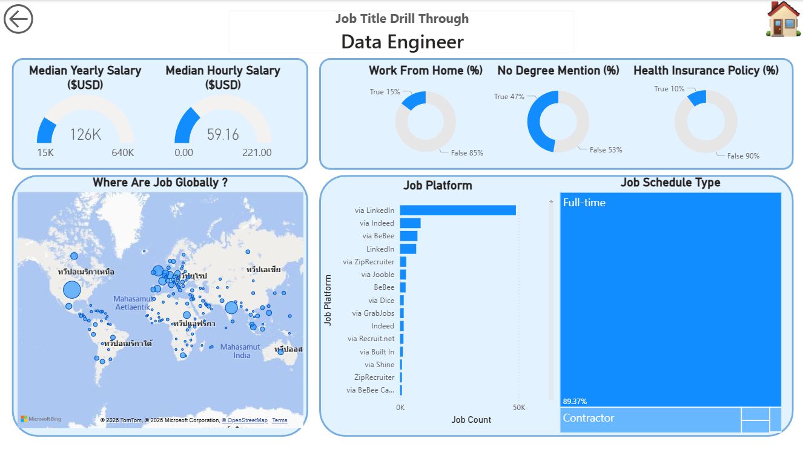

# Introduction

Here is my project on data job analysis dashboard using Power BI tool that reflect my main interest in data job before deciding to have a transition into data job. Below is my question to answer  ;

- **Global median yearly salary of data job**
- **Global median hourly salary of data job**
- **Count of data job globally**
- **Combination of dashboard of each job**

> **Median statistics** is used for the reason that the dataset for salary are used in this project is not normally distributed . 

Check the Power BI dashboard : [**Data_Job_Dashboard**](Data_Job_Dashboard.pbix)

Please feel free to dive deep into dashboard using Power BI tool

# Background

This project aim to gain the perspective of data job that I am transitioning into. My goal is to derive information regarding to **salary, the number of job, other aspect of data job**

The dataset in this project is from [**Link**](https://drive.google.com/drive/folders/1DWmAUNAuamqinMvpQiko_bZzXKG7JEr5)

# The question I want to answer
## Who am I designing this for

- **Job Seekers**
- **Job Transitioners**
- **Job Swappers**

## What problem am I trying to solve ?
- **Those looking for data roles often struggle because information about the job market is scattered.**
- **There's no single, easy way to quickly grasp the overall trends of the market, typical compensation levels, and general job quality.**

# Tool I used
To accomplish this project. I am equipped with powerful several key tools ;
- **Power BI** : The main tool for dashboard, allowing me to visualize the data and discover critical insights.
- **Visual Studio Code** : My file management tool for version control and sharing the project file to Github .
- **Git & GitHub** : Essential for version control and sharing my project file including Power BI file, ensuring collaboration and project tracking.

# ERD of the tables

*Graphic of Entity relatationship diagram (ERD) in the star schema format.*

*Entity relatationship diagram (ERD) in Model view in Power BI in the star schema format.*

# Dashboard layout

*This report is split into two distinct pages to provide both a bird-eyed perspective and detailed information regarding user selection.*

## Planning
### Page 1 : Data Job Dashboard
Below is how the first page of my dashboard is going to look like that name **"Data job dashboard"**. this first page of dashboard shows the bird-eyed view of the data job market including KPIs card of job count, median yearly salary, and median hourly salary

This first page also include the visual the trend of the job posting, comparison between hour salary and yearly salary, which job are the most popular among data job, and finally the job state.

### Page 2 : Job Title Drill Through
Below is the second page of my dashboard named **"Job title drill through"** showing the specific information regarding user selection from the first page of the dashboard.

This second page is designed to dive deep into the specific information about those drilled-through job title selection providing the trend work form home status, no-degree-mentioned job, and health insurance policy. This page also consist of specific job location, job posting platform, and job schedule type (Full-time, Part-time, Contrator, etc.)

## Designing

### Page 1 : Data Job Dashboard

This is overall view for the data job market. It showcases key KPIs like total job count, median salaries, and top job titles to give mea quick understanding of what's happening in the job market at a glance.

### Page 2 : Job Title Drill Through

This is detailed-information page. From the main dashboard, you can drill through to this view to get specific details for a single job title, including salary ranges, work-from-home stats, top hiring platforms, and a global map of job locations.

# What I Learned
This project was a journey to showcase key Power BI skills, including :

- **Data Transformation (Power Query)** : Cleaned and prepared raw data for analysis.
- **Measures & KPIs** : Created metrics such as Median Yearly Salary and Job Count.
- **Implicit measure** : Designated the implicit mesure so that the user are able to understand the components in the visual
- **Data Visualization** : Built column, bar, line, area, map, card, and table visuals.
- **Dashboard Design** : Developed an intuitive and visually appealing dashboard layout.
- **Interactive Reporting** : Implemented slicers, bookmarks, buttons, and drill-through navigation for enhanced user experience.

# Conclusions
This interactive Power BI dashboard analyzes job posting data to uncover trends in salaries, job demand, and required skills, helping users make informed career decisions through dynamic visualizations and filtering tools.

## Insights

- **Job Demand** : *Data Analyst, Data Engineer, and Data Scientist roles accounted for the highest number of job postings. Demand varied significantly across job titles, indicating different market needs and hiring priorities.*

- **Salary Trends** : *Median yearly salaries differed substantially between roles. Higher-paying positions generally required more specialized technical skills and experience as the job daa implies.*

- **Geographic Distribution** : *Job opportunities were concentrated in specific countries and regions. Remote positions expanded access to opportunities beyond traditional tech hubs.*

- **Career Opportunities** : *Different roles offer distinct trade-offs between job availability and compensation. Understanding the relationship between skills, salary, and demand can help job seekers prioritize their learning paths.*

- **Data-Driven Decision Making** : *Interactive filtering and drill-through capabilities enabled deeper exploration of job market trends. The dashboard provides a practical tool for comparing career options and identifying valuable skill investments.*

## Final Takeaway

This project demonstrates how Power BI can transform raw job market data into meaningful insights through data cleaning, modeling, visualization, and interactive reporting.
By analyzing job demand, salaries, and required skills, the dashboard helps users make more informed career decisions while showcasing the power of data-driven storytelling. Throughout this project, I strengthened my skills in Power Query, DAX measures, dashboard design, and interactive report development.

## Closing Thoughts
Building this dashboard allowed me to apply the complete Power BI workflow, from data preparation and modeling to visualization and interactive reporting. Beyond the technical skills gained, the project reinforced the value of data storytelling—transforming complex information into insights that support better decision-making. It represents an important milestone in my transition toward a Data Analyst role and reflects my commitment to continuous learning and improvement.